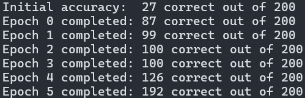

# nlp
Implementations of natural language processing (NLP) models.

## Getting Started
### Setup
1. Create a new virtual environment:
    ```shell
    pyenv virtualenv 3.13 nlp
    ```
1. Activate the new environment:
    ```shell
    pyenv activate nlp
    ```
1. Install dependencies:
    ```shell
    pip install -r requirements.txt
    ```
1. Install `mkranzlein/nlp`:
    ```shell
    pip install -e .
    ```

### Try Out a Model

```shell
python src/nlp/models/feedforward_no_deps.py
```

## Models
- ✅ [`models/feedforward_no_deps.py`](src/nlp/models/feedforward_no_deps.py): A working implementation of a feedforward
neural network built from the ground up, including manual backpropagation, with no third-party dependencies like NumPy or PyTorch.
    
    

- ❔ [`models/perceptron.py`](src/nlp/models/perceptron.py): A (not yet tested) implementation
of a simple perceptron.